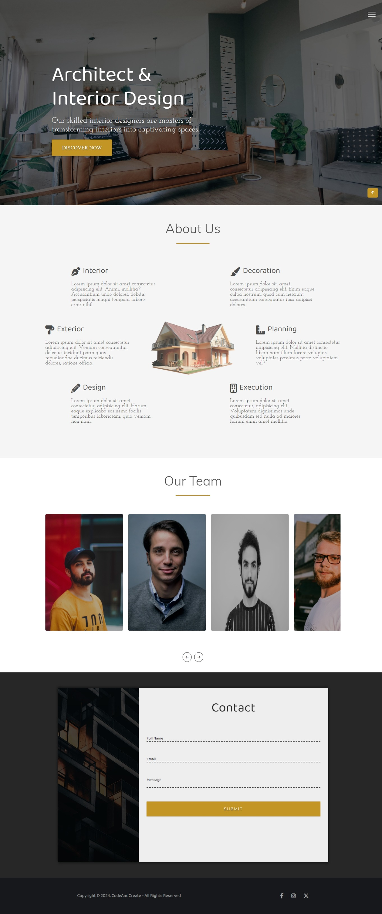

# Architect

Interactive Page With Cool Animation Effects To Make The User Experience Enjoyable.

## Table of contents

- [Overview](#overview)
  - [Architect features](#Architect-features)
  - [Screenshot](#screenshot)
  - [Links](#links)
- [My process](#my-process)
  - [Built with](#built-with)
  - [What I learned](#what-i-learned)
- [Author](#author)

## Overview

### Architect features

Users should be able to:

- See the spinner with the cool animation effect when the page loads.
- Animation at the landing to display the content.
- Control over nav by hamburger icon and transition between sections smoothly.
- Use the slider for team members and see the cool effects created by tilt.js when hovering over a member.
- See hover and focus states for all interactive elements on the page.
- View the optimal layout for the interface depending on their device's screen size.

### Screenshot

### Links

- Live Site URL : [Architect](https://mahmoudsmohammed.github.io/Architect/)

## My process

### Built with

- HTML 5
- CSS 3
- SASS
- TypeScript
- JavaScript
- Font Awesome
- Tilt.js

### What I learned

- How structure the project files.
- Using Git and Github.
- Use TypeScript Which Makes it Easy To Debug The Code.
- Use SASS which makes Nesting and Variables More Organized.
- How to Manipulate the DOM.
- Make animation and create cool effects using hover and focus states.
- Make the page responsive to fit all screen sizes.
## Author

- Linkedin - [Mahmoud Sayed](https://www.linkedin.com/in/mahmoud-sayed-b85536217/)
- Codewars - [@MahmoudsMohammed](https://www.codewars.com/users/MahmoudsMohammed)
